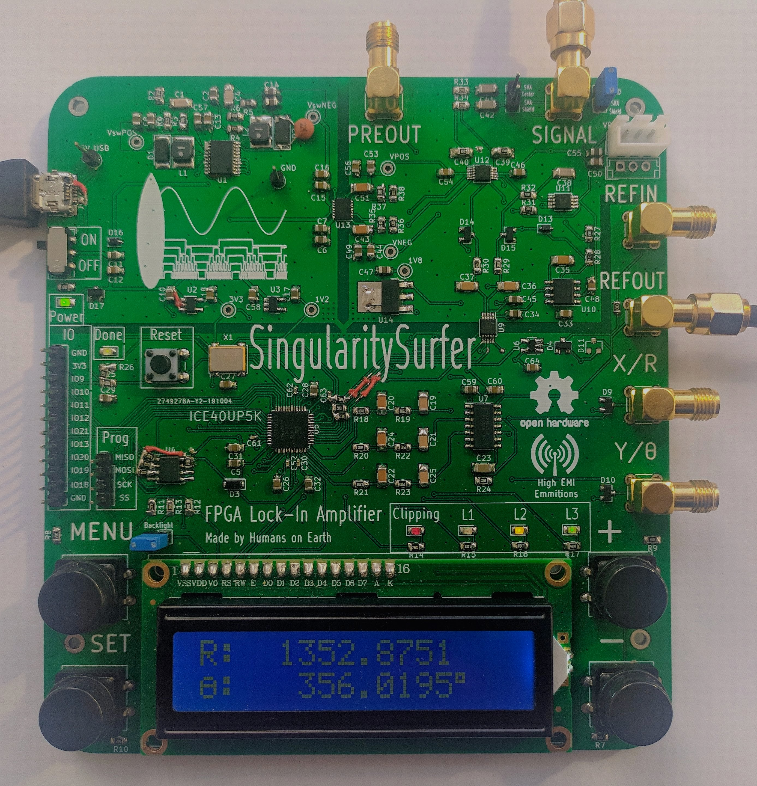
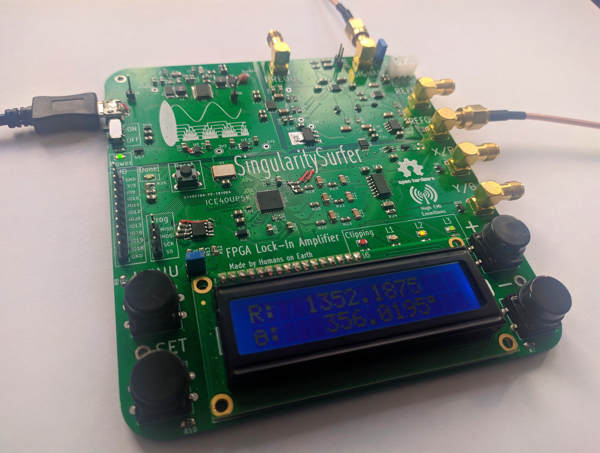
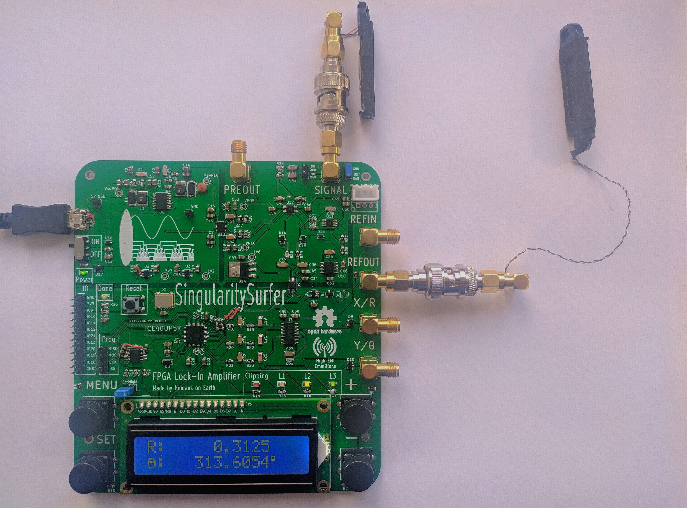
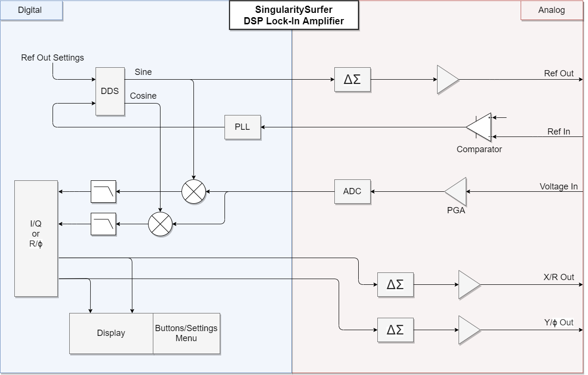

# SingularitySurfer: An FPGA Lock-In Amplifier
Repository of an FPGA based DSP Lock-In Amplifier.

## Fotos:

Measuring the change of phase due to changing the distance of two speakers (of which one functions as a crappy microphone):

## Block Diagram:

## Overview:
Lock-In amplifiers are a very useful tool in many physics and bio experiments where your signal of interest might be covered by a lot of noise and interference. It does so by effectively correlating out the signal of interest. As analog components are always subject to noise, drift and non-linearities, performance in a DSP Lock-In can be far superior.
The project leverages the affordable ICE40 FPGA with its fully open source toolchain to implement the digital signal processing. Analog components are implemented in a manner that strikes a balance between performance and cost. As the analog frontend mostly determines the overall performance, a focus was put on its implementation. The total BOM cost is below 70€.
The SingularitySurfer was developed as a personal learning platform that I share so others can get design ideas and see my approach. It does not intend to give reference designs or to teach the subject. 
Cores from other people:
* CORDIC: https://opencores.org/projects/verilog_cordic_core
* SPI flash reader: https://github.com/smunaut/ice40-playground/tree/master/cores/spi_flash
* 2x16 character display driver: https://opencores.org/projects/wb_lcd

The next sections will describe the features of the various sub-systems, their development and the design decisions made.

## Digital architecture:
All of the FPGA cores run at a 36MHz base clock and the numeric oscillator, DDS, PLL and DACs also run at this sample frequency. However the ADC samples at 900kHz and the digital filters further downsample the signal by a factor of 1024. The DDS and the ADC produce signed 16 bit signals, while the output of the multipliers and filters are signed 32 bit. The phase signals from the PLL and oscillator are 18 bit. Due to FPGA LUT constraints, the CORDIC core only uses signed 16bit precision and the algorithm is terminated after 9 iterations. Most of the cores, especially the CORDIC core, make use of pipelining to maintain the 36MHz clock. The full design takes up about 85% of the FPGA LUTs.

## FPGA:
The Lattice ICE40UP5K is an ideal platform for a small DSP project like this. It offers:
* sufficient LUTs for all of the wiring, UI, display and housekeeping
* 8 16x16 hardware multipliers for signal processing
* 1Mbit of internal SRAM for storing a high fidelity sinus lookup table
* QFP package which is easily soldered by hand
* affordable price at just 5€
* fully open source toolchain!

## Analog frontend:
As all of the digital signal processing is deterministic and can be upgraded at a later point, the Lock-In’s performance is ultimately determined by the analog frontend. The goal is to transfer the signal into the digital domain with little disturbance. This requires high dynamic range, low noise and high linearity. But as cost was also a factor in the development, compromises had to be made. The design employs:
* ADC: MCP33131D, 1MSps, 16bit, 91.3dB SNR 
* Voltage reference: REF5050, low noise, low drift
* PGA: AD8253, 0-60dB gain, low distortion, low noise, instrumentation amplifier
* OpAmp: AD8675, low noise
* Voltage regulator: LT3032-15, dual +-15V, low noise

At the input there is a 100kHz RC lowpass and the ADC AA filter is tuned to 100kHz as well. The PGA doubles as the ADC driver, using the AD8675 to make the signal differential. This setup was used to cut the cost of a dedicated ADC driver. Unfortunately it does limit performance, as it does introduce some distortion due to the PGA output not being fast enough to drive the ADC (which is not critical as distortion is essentially the same as noise well outside the passband of the digital lowpass). Broadband noise from the analog components was below the quantization noise and therefore not visible at the ADC output.

## DDS and numeric oscillator:
The direct digital synthesis core generates a digital representation of a sinusoidal using a 1/4 sinus look-up table stored in the 1Mbit SRAM. The other 3/4 of the sine and the cosine can be easily generated from the first 1/4 using symmetries. Therefore a high fidelity, 16bit amplitude, 18bit phase representation of the sinusoidals can be generated. When using an external reference signal, the DDS uses the phase of the digital PLL locked to the external reference signal. When generating its own reference signal, a numeric oscillator with an internal 32bit phase accumulator is employed. 
In order to avoid spurious tones in the output spectrum of the DDS when using the internal oscillator, dithering of the last phase-bit is applied using a linear-feedback shift register. Unfortunately the ICE40 SRAM blocks don't support initial values in the FPGA bitstream. Therefore the look-up table is permanently stored in the external SPI flash and loaded into SRAM after every startup.

## DAC:
As the Lock-In’s performance is not dependent on the output reference signal (as long as it contains a strong spectral component exactly at the reference frequency and other spectral components are masked by the noise added in the DUT), a basic sigma-delta DAC is used. Same goes for the X/R and Y/Theta "baseband" outputs, as they are essentially just DC (however DC accuracy has to be considered here) . The sigma-delta DACs require just a single FPGA pin and a passive second order lowpass with buffered output as external hardware in order to generate analog signals. Inside the FPGA the DAC uses a basic first-order sigma-delta modulator. With a modulator frequency of 36 MHz and 100kHz lowpass cutoff, the SNR is still better than 60dB. However switching many single-ended FPGA pins at these frequencies might lead to high EMI emissions. This was tried to be avoided by placing the lowpass filter close to the FPGA pins.

## PLL *(experimental)*:
The all-digital PLL gets a clean digital input signal by the use of a Schmitt-Trigger at the reference input. It uses a 32bit phase accumulator and 17bit phase increment word which leads to good phase precision. The DP controller can update the phase increment word without the need for multipliers by simply bit shifting the error signals. The controller can therefore only be tuned very coarsely which was done by simple trial and error. With this setup the controller can lock and track any reference signal between 500Hz and 100kHz. However it can get stuck in "limbo" with an aperiodic input signal and needs a reset to recover.

## Multipliers and CIC filter:
Twor 16x16 hardware multipliers directly "mix" the incoming ADC samples with the sine/cosine signals from the DDS core. The output is therefore a 32bit signal at ADC sampling speed. 
This signal needs to be lowpass filtered to get rid of the undesired mixing products, ideally with a very low cutoff frequency (i.e. long time-constant). At ADC sampling speed this would require a lot of memory. But as the desired signal is bandlimited to a very low frequency (10s or 100s of Hz), a high sampling rate is unnecessary. A cascaded integrator comb (CIC) filter can downsample and lowpass filter the signal at the same time. Furthermore the cutoff frequency can easily be changed in powers of two and it doesn’t require hardware multipliers. 
The downside is that the frequency response is far from an ideal lowpass. Fortunately in the case of the lock-in, this is not critical, as the cutoff frequencies are so low and the upper mixer output products are far higher than fc (it will just let more noise through which can be counteracted by a longer filter time constant). In fact right now, only a single IC stage is used in the SingularitySurfer, as there is already not enough memory for a second integrator. A good improvement would be to follow the CIC with an IIR filter using the remaining hardware multipliers.

## CORDIC:
The CORDIC algorithm computes the angle and magnitude of the sine and cosine signals. The original core by Dale Dickard was extended to support full 360 degree rotation and modified to fit into the remaining ICE40 logic. 

## Display and UI:
The display allows direct monitoring of the Lock-In outputs and user interaction with the UI. The UI is controlled via four buttons on the side of the display. This way the user can navigate through the device settings:
* Filter time constant: between 2^0 and 2^7 milliseconds
* PGA gain: 0dB, 20dB, 40dB, 60dB
* Internal/external reference 
* Internal reference frequency: 500Hz, 1kHz, 2kHz, 5kHz, 10kHz, 20kHz, 50 kHz, 100kHz
*  Internal reference output amplitude: 0.45V, 0.9V, 1.6V, 3.3V (peak to peak)

The signal monitoring can easily be switched between X/Y and R/θ view. The display is a simple 2x16 character LCD display with built-in character ROM. Unfortunately, the maximum update rate of such a display is about 2Hz. A higher update rate would lead to a more direct user feedback when monitoring signals. The logic to drive the display, show text, decimal numbers, etc., is actually not trivial and a small embedded processor could be a better idea in a future project.

